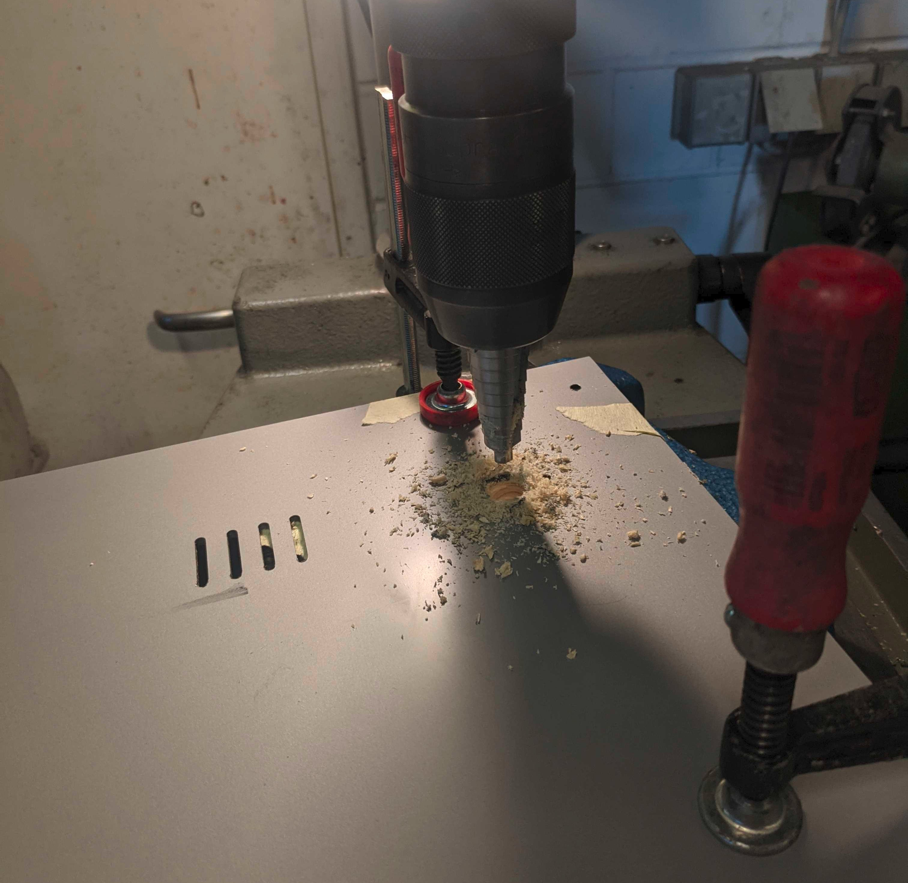
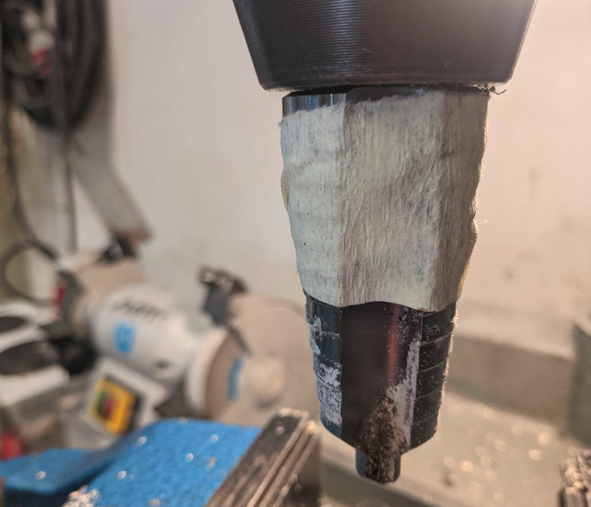

# Converting your CreatrHS to run Klipper

This guide is to give you some directions for converting your CreatrHS to run Klipper.

**This guide is meant for people who know how to work with electricity, machines or think they do. Converting this printer is not plug and play**

## The Configuration File: printer.cfg

The Config file is [here](printer-leapfrog-creatrhs.cfg)

**Right now it misses the Config for extruder 2** It is going to get its config as soon as I get to it. (or if you do a merge request.) A useful help are the [Board Schematics](https://web.archive.org/web/20240830094400/https://lfa.attachments1.freshdesk.com/data/helpdesk/attachments/production/11101744414/original/CREATR%20BOARD.pdf?response-content-type=application%2Fpdf&Expires=1725011290&Signature=dpvySAFBVW4ipRwD9~7R9Cuwm3PYWvf6KwDW55T5wYOICNJGnqRWu35d~Cr-krjGiwyRBcZ--2P7VvnGxWv13HQSA5mhHV4cGhPwk66fWUtpQEWxCh1dMR2BIIgs7sXd9vRtaDro5kCVBf6w2xW5u3MBOat2ZVZujJsVqfMOYA4wLmk65hAdXj4d7j7fnBiW231HBsGbrVoCLWRDgN27WuWN~Dni~IT2VJM0QOBDJxG4TvBaV9Q7M-VnRxW4jS1igFgoHYQiatCVFsceoiW-~6AnvqbTPmJzg~6R8GzrPTZl00lWfxtliIRzC1Oy~9nxDWNfrE0gWegF-psUHMfZFQ__&Key-Pair-Id=APKAJ7JARUX3F6RQIXLA)

## Testing

You Probably want to test this idea first: Take off the *right sidepanel* and maybe the *top electric cover*. Connect your Raspi (with Klipper/MainsailOS installed) via USB tho the *Mainboard* (it's the green one) and flash the board.

## Conversion

### Taking out the Mainboard

Also see [leapfrog](https://support.lpfrg.com/support/solutions/articles/11000019686-how-to-replace-the-motherboard-of-your-creatr-hs) [(archive)](https://web.archive.org/web/20240920154111/https://support.lpfrg.com/support/solutions/articles/11000019686-how-to-replace-the-motherboard-of-your-creatr-hs)

- Remove the Following parts: (keep your screws sorted!)
  - *Left* and *right* *Side-Panels*
  - *Top Cable Cover*
  - *Front Cable Cover*
  - *Back-Panel*
- disconnect all cables from *mainboard* (and label them!)
- Take out the *Mainboard* (it's the green board)

### Removing the Olimex

- Disconnect All Cables from the *Olimex board* (the red board)
- Take out the *Cable* used to connect to the Mainboard (we are going to use it later again)
- Also take out the cable which is going to the back of the Printer we can't use it anymore.
- Remove the Mainboard by compressing the clips.
- If you remove the Clips be sure to also remove the screws for them.
- Remove The *DC-DC-Powersupply* for the *Olimex*

### (Optional) Add a RJ45 Passthrough for the Lan

- I used a *[Neutrik](https://www.buerklin.com/en/p/neutrik/network-adapters/ne8fdp-b/80F5189/)* [(archive)](https://web.archive.org/web/20240922175245/https://www.buerklin.com/en/p/neutrik/network-adapters/ne8fdp-b/80F5189/#expand) one
- Drill a Hole in the back according to your hole Pattern
  - I recommend a *Step Drill*
  - 
  - Tip: Mark your final diameter with a bit of Tape
  - 

### Mounting The Raspberry Pi

- Aquire a *Case* for your *Pi*.
- You can Screw it in or just glue the bottomside of the *case* down. Do what you want.
- If you want to mount it with scews:
  - Mark your Hole-Locations, Drill and Tap them:
  - 
  - Screw your *Pi-Case* into it.

### Mount the Raspberry Pi Powersupply

- I used a Traco [*TMDC 10-2411*](https://www.buerklin.com/en/p/traco-power/dc-dc-converters/tmdc-10-2411/32C4535/) [(archive)](https://web.archive.org/web/20240922180005/https://www.buerklin.com/en/p/traco-power/dc-dc-converters/tmdc-10-2411/32C4535/) DC-DC one. You can use whatever you want.
- Mount the *PSU* between the *Pi* and the *PSUs*
  - Glue it down **or**
  - Screw it down
  - 

### Connect the Power

(you can fry your pi if you do something wrong here)

- Get a *micro-USB-cable*, cut it to length and crimp the red and black wire.
- connect it to Vout of your *psu*
- connect the Vin side of your *psu* to 24V **or** 230V depending on your *psu*

### Putting it all back togehter

- Connect the power *usb-cable* to your *pi*
- Plug in the Lan-Cable
- Plug in the USB-A side of your usb cable to connect to your motherboard
- (optional) plug the *front-usb-cable* into your *pi*
- (optional) plug in a *usb webcam* (see [# Webcam](## (optional) Webcam) )
- Screw in your *mainboard*
- plug everything back into your *mainboard*
- mount the *back-panel*
- do a test (see also ##Testing if you didn't do it beforehand)
- mount all the other panels
- be happy :)

## (optional) Webcam

It is pretty easy to mount a webcam at the back and rout the cable to the Pi. I use a *Logitech C920*

 

- Mark where you wantt to put you *webcam*. (remember the top)
- stick your *webcam* down with some tape
- route the cable to the *pi*
